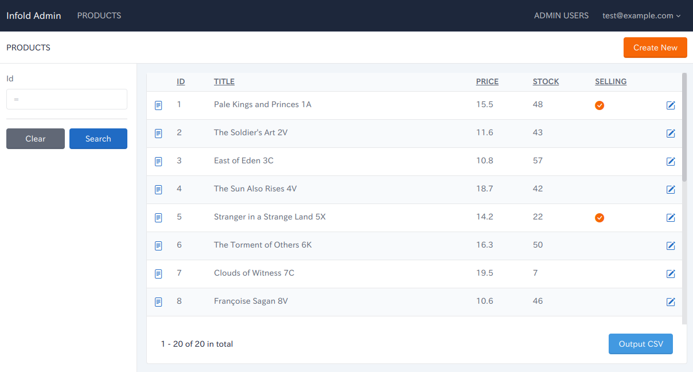
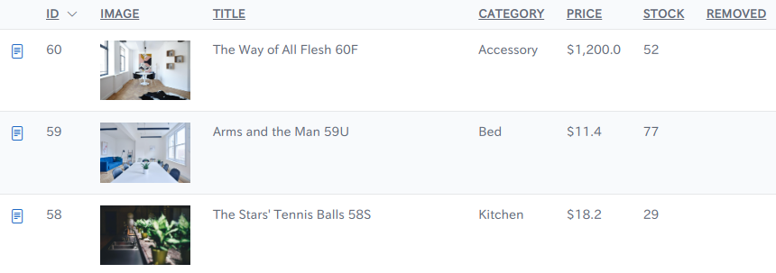
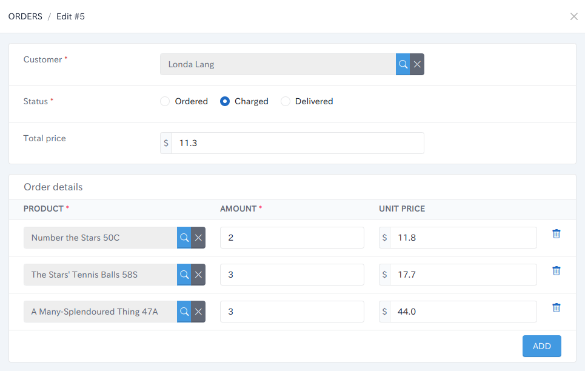
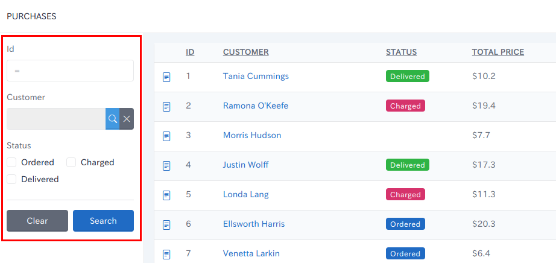
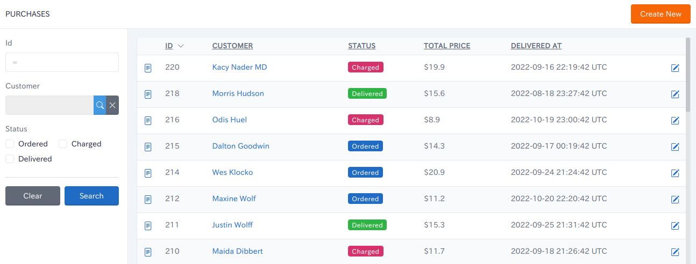
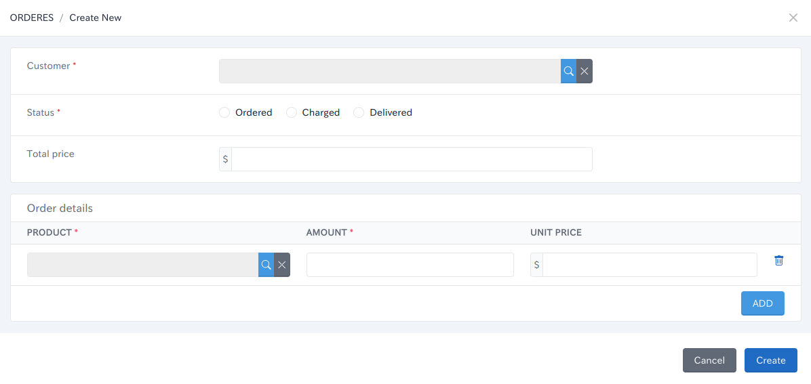
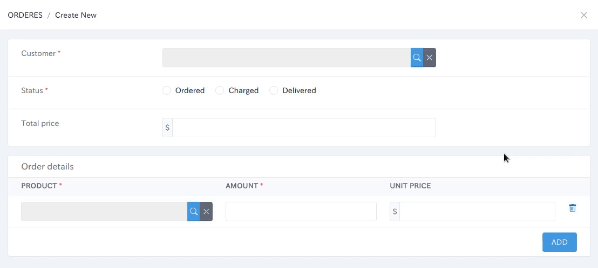

# Infold
Infold provides Scaffolding functionality specifically for Internal tools.
CRUD (Create, Read, Update, Delete) applications with an easy-to-use UI can be built instantly.
The generated code is highly readable and customizable, allowing for easy additional customization.
Supports Rails >= 7.0 and Hotwire.

## Goals
- Quickly and easily build Internal tools with all the functionality you need
- No need for a designer, just a developer to create a usable UI/UX
- Easy customization with YAML and Scaffold instead of DSL development

## Getting started
- Try the [live demo](https://demo.infold.dev/admin).
- Check the [website](https://infold.dev).

## Installation
Add this line to your application's Gemfile:
```ruby
gem 'infold', require: false
```

In addition, infold uses the following Gem, add these lines to your Gemfile too.
```ruby
gem 'devise'           # Certification
gem 'haml-rails'       # HAML
gem 'kaminari'         # Pagination
gem 'view_component'   # View Component
gem 'active_decorator' # Decoration
gem 'enum_help'        # Enum Helpers
```

Then run `bundle install`

Next, you need to run the generator:
```shell
$ rails generate infold:install
```

At this point, several common files for CRUD applications are generated.

### Devise Setup
With the above installation, Devise is also installed. Please migrate for Device user's table.
```shell
$ rails db:migrate
```

Create a test user for Devise from rails console.
```shell
$ rails console
```
```ruby
AdminUser.create(email: 'user@example.com', password: 'password')
```

## Basic Usage
Specify the target model for CRUD and generate code from the generator.
The following is an example of a Product model.
```shell
$ rails generate infold Product
```

The above commands will generate several files, including Controller and View.
You can check it by starting rails from `bin/dev` and accessing `http://localhost:3000/admin`.



By executing the above command, each directory, such as controllers, models, and views, automatically generates code to run the internal tools.  
This mechanism is similar to Rails' Scaffold, and it is possible to implement additional necessary functions based on this.

However, **this is not the only functionality that can generate from Infold**.  
Let's customize YAML and automatically generate the necessary functions by referring to the following contents.

## More Customization
Infold can be customized more by configuring YAML. YAML is generated in the `config/infold` directory.
After setting up YAML, the code is regenerated by executing the following command.
```shell
$ rails generate infold:scaffold ResourceName (eg: Product)
```

### YAML for demo apps
The YAML file for the [demo apps](https://demo.infold.dev/admin) can be referenced [here](https://github.com/yamataka22/infold/tree/main/test/dummy/config/infold). Please refer to it.

### Validation
In `model`.`validate`, you can define validation for each field.
#### Example
The following example shows the `title` and `price` fields with required validation and the `price` field with numeric and greater than or equal to 0 validation.
```yaml
model:
  validate:
    title: presence
    price:
      - presence
      - numericality:
          greater_than_or_equal_to: 0
```
Then validation is activated on the form screen.


### Enum
In `model`.`enum`, you can define enum field.
#### Example
The following example defines an enum in the `status` field and sets the elements to `ordered`(value: 1), `charged`(value: 2), and `delivered`(value: 3).
```yaml
model:
  enum:
    status:
      ordered: 1
      charged: 2
      delivered: 3
```

Then the screen displays the Name of the Enum.


#### Colored Enum
Enum also allows you to specify a color for each element.
The available colors are `blue`, `azure`, `indigo`, `purple`, `pink`, `red`, `orange`, `yellow`, `lime`, `green`, `teal` and `cyan`.
#### Example
```yaml
model:
  enum:
    status:
      ordered:
        value: 1
        color: blue
      charged:
        value: 2
        color: pink
      delivered:
        value: 3
        color: green
```

It will then be displayed with a colored badge for easy identification.


### Decorator
In `model`.`decorator`, you can define simple decorations such as comma-separated numbers and units.
#### Example
In the following example, the `price` field indicates a comma-separated number and "$" as the unit of measure in the front, and the `weight` field indicates "Kg" in the back.
```yaml
model:
  decorator:
    price:
      prepend: $
      digit: true
    weight:
      append: Kg
```

Price indicated as comma-separated and with units.


### ActiveStorage
Infold supports ActiveStorage. If you want to store files such as images or PDFs, define them in the `model`. `active_storage`.

**As a prerequisite, ActiveStorage must installed in the project.**
#### Example
In the following example, define the use of ActiveStorage with the name `photo` and select "image" as kind (for PDF, etc., select "file" as kind).
```yaml
model:
  active_storage:
    photo:
      kind: image
```

Then images stored in ActiveStorage can be displayed.



### Association
Infold supports an association with other models such as `has_many` and `belongs_to`. By defining `model`.`association`, it is possible to bulk register and reference, related models.
### belongs_to
For example, the relation `purchase` belongs_to `customer` is defined as follows:
```yaml
model:
  association:
    customer:
      kind: belongs_to
```
#### Naming field
In the case of `belongs_to`, the field representing the record name of the referenced parent model, if any, is defined in `name_filed`.  
The `customer.name` associated with the `customer_id` is displayed. The `customer` is also displayed as a link, which can be clicked to view the details of the `customer`.
```yaml
model:
  association:
    customer:
      kind: belongs_to
      name_field: name
```


### has_many, has_one
For example, the relation `order` has_many `order_details` is defined as follows:
```yaml
model:
  association:
    order_details:
      kind: has_many
      dependent: destroy
```

The `app.show.fields` settings described below will enable batch registration and referencing of has_many.

#### Batch reference in detail view


#### Advanced configuration of the referenced model in `has_many`.
For example, in a `has_many` association, such as `order` and `order details`, you may want to register multiple `order details` at once when registering `order`.
In this case, by defining the `model` in the association model, Validation, Enum, etc., can be defined in the same way as above.
#### Example
In the example below, there is a `has_many order_details` association.
For this `order_details`, define a required validation for the `product_id` field, and a decorator for the `amount` field. It also defines an `association`.`belongs_to` for the `product` with which the `order_detail` is associated with.
```yaml
model:
  association:
    order_details:
      kind: has_many
      model:
        validate:
          product: presence
        decorator:
          amount:
            digit: true
        association:
          product:
            kind: belongs_to
            name_field: title
```

#### Bulk Registration Form
In the following example, multiple lines of OrderDetails can be registered at once.  
You can add rows from the ADD button and delete records with the trash icon.



## View Customization
### Index (list) view
#### Search conditions
In `app`.`index`.`conditions`, you can define search condition for the resource.
The condition specifies `sign` and `form_kind`.

sign can be specified as follows:
- eq (equal)
- lteq (less than equal)
- gteq (gather than equal)
- full_like (like %...%)
- start_with (like ...%)
- any (Used to specify multiple elements of Enum with "or")

form_kind can be specified as follows:
- text
- number (input type="number")
- select
- switch (Used with the boolean type)
- association_search (For association columns in belongs_to, `association_search` allows you to search and specify the related tables from the child screen.)

#### Example
For example, equal search for id, association search for customer_id, and multiple checkboxes for status are defined as follows:
```yaml
app:
  index:
    conditions:
      - id:
          sign: eq
      - customer_id:
          sign: eq
          form_kind: association_search
      - status:
          sign: any
          form_kind: checkbox
```



#### List
In `app`.`index`.`list`, you can define which items are displayed in the list and the default sort order (you can change the sort order by clicking on the header cell of the list).  
If you specify an association name in the list field, the name_field of the associated destination will be displayed in link format.
#### Example
```yaml
app:
  index:
    list:
      fields:
        - id
        - customer
        - status
        - total_price
        - delivered_at
      default_order:
        field: id
        kind: desc
```



#### CSV output
Infold also allows CSV output of search results. Define the target columns in `app`.`index`.`csv`.`fields`. If empty, all fields will be output.

#### Example
```yaml
app:
  index:
    csv:
      fields:
        - id
        - title
        - price
        - created_at
        - updated_at 
```

### Show (detail) view
In `app`.`show`.`fields`, you can specify the fields and the order in which they are displayed on the detail screen.  
If you include has_many / has_one associations in the field, you can also specify fields for the associated destination model.

#### Example
- The following example shows fields such as `id` and `status` to be displayed.
- It also displays the `customer.name_field` by including the `customer` in the `belongs_to` association.  
- In addition, the has_many association `order_details` is included. The `product`, `amount` and `unit_price` of this `order_details` are specified as the display field.
```yaml
app:
  show:
    fields:
      - id
      - customer
      - status
      - order_details:
          fields:
            - product
            - amount
            - unit_price
      - created_at
```


### Form (Registration and Edit) view
In `app`.`form`.`fields`, you can define fields for registration and update forms.

Specify the form type from `kind`, `kind` can be specified as follows:
- text (default)
- number (input type="number")
- email (input type="email")
- password (input type="password")
- text_area
- radio
- select
- switch (boolean)
- file (defined in ActiveStorage)
- association_search (For association columns in belongs_to, `association_search` allows you to search and specify the related tables from the child screen.)

If has_many/has_one of association is specified in the field, batch registration of related models is enabled.

#### Example
- Able to search and specify the related customer from a child screen (related to `order belongs_to customer`)
- The `status` allows radio button selection of Enum elements
- The decorator's append($) set to `total_price` is displayed on the form
- Enable batch registration of related data, including `order_details`, which are related to has_many.
    - Display `product_id`, `amount`, `unit_price` from related `order_details` on the form
    - In relation to `order_detail belongs_to product`, the related product can be searched from the child screen.
    - ADD button to add rows.
```yaml
app:
  form:
    fields:
      - customer:
          kind: association_search
      - status:
          kind: radio
      - total_price:
          kind: number
      - order_details:
          kind: association
          fields:
            - product_id:
                kind: association_search
            - amount
            - unit_price
```



### Association search view
Fields related to `belongs_to` can be searched and selected from the child screens for data in the related model.

**Note: Child screen should be defined in the caller's resource (YAML). For example, in the case of `order belongs_to customer`, define the association_search in the YAML of the `customer`, not in the `order`.**

The configuration is the same as for `app`.`index`. Define the necessary fields for `conditions` and `list`.
#### Example
- Use `name` and `email` as search criteria
- list `id`, `name` and `email`.
```yaml
app:
  association_search:
    conditions:
      - name:
          sign: full_like
      - email:
          sign: start_with
    list:
      fields:
        - id
        - name
        - email
```
If a customer is defined as kind=association_search on the Order form, the customer can be searched and selected from the child screens.



## Dependencies
Infold is built with other open source projects:

| TOOL                                                             | DESCRIPTION                                                                |
|------------------------------------------------------------------|----------------------------------------------------------------------------|
| [tabler](https://github.com/tabler/tabler)                       | HTML Dashboard UI Kit built on Bootstrap                                   |
| [devise](https://github.com/heartcombo/devise)                   | Flexible authentication solution for Rails with Warden.                    |
| [kaminari](https://github.com/kaminari/kaminari)                 | Clean, powerful, customizable and sophisticated paginator                  |
| [enum_help](https://github.com/zmbacker/enum_help)               | Help ActiveRecord::Enum feature to work fine with I18n                     |
| [view_component](https://github.com/github/view_component)       | A framework for building reusable, testable & encapsulated view components |
| [active_decorator](https://github.com/amatsuda/active_decorator) | A simple and Rubyish view helper for Rails                                 |
| [haml-rails](https://github.com/haml/haml-rails)                 | A templating engine for HTML                                               |


## License
The gem is available as open source under the terms of the [MIT License](https://opensource.org/licenses/MIT).
